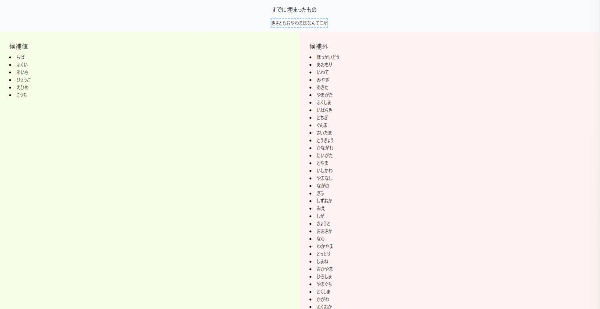

# kotoba-asobi

## 説明

これ見て都道府県を平仮名で言っていってそんなにヒットしないことある？ と思ったので雑にシミュレーションしてみるやつ（何してるのかよくわからないと思うので、まずは動画を見てください）。

[【ボドゲ実況】全年代で遊べる「あいうえバトル」で 白熱バトル！！！！！ - YouTube](https://www.youtube.com/watch?v=GYBlSWybh8U)

## 試す

GitHub Pages で使えるはず。下記にアクセス。

https://www.yumechi.work/kotoba-asobi/index.html

下記の仕様です。

* 入力はひらがな前提です
* 濁点、半濁点の入力は想定していないです
    * ちゃんと試してないけどマッチングがうまくいかなくなるだけだと思う
* 「き」の入力で「ぎ」がヒットするなど、濁点ありのものがヒットするようにしています
* 「よ」「つ」の入力が「ょ」「っ」としてヒットします

## 使ったもの

- Vue 3.X
- Tailwind CSS 3.X

ペライチなのでCDNからとってます。

## 実際に使ってみる

「きさともおやわまほなんてにかみ」まで入れてみたところ。

## 参考にしたもの

- Vue公式ドキュメント https://v3.ja.vuejs.org/guide/introduction.html
- Tailwind CSS 公式ドキュメント https://tailwindcss.com/docs/installation
- コピペで使える都道府県一覧リスト・県庁所在地一覧 HTMLタグ| Start Point https://www.start-point.net/maps/tool/ 
- VueのCDN版を使おう - やわらかVue.js https://scrapbox.io/vue-yawaraka/Vue%E3%81%AECDN%E7%89%88%E3%82%92%E4%BD%BF%E3%81%8A%E3%81%86 
    - バージョン2系のものなので参考程度に
- JavaScriptで濁音や半角カナの処理 - Qiita https://qiita.com/jkr_2255/items/e0c039c438d3ebfd1a6a 
    - 単純に知らなかったです
- String.prototype.normalize() - JavaScript | MDN https://developer.mozilla.org/ja/docs/Web/JavaScript/Reference/Global_Objects/String/normalize
